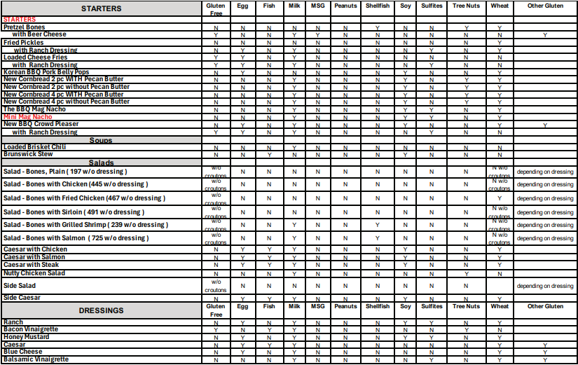
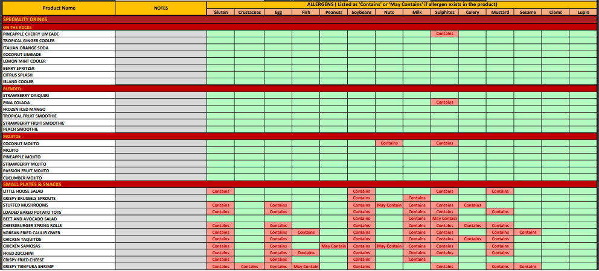
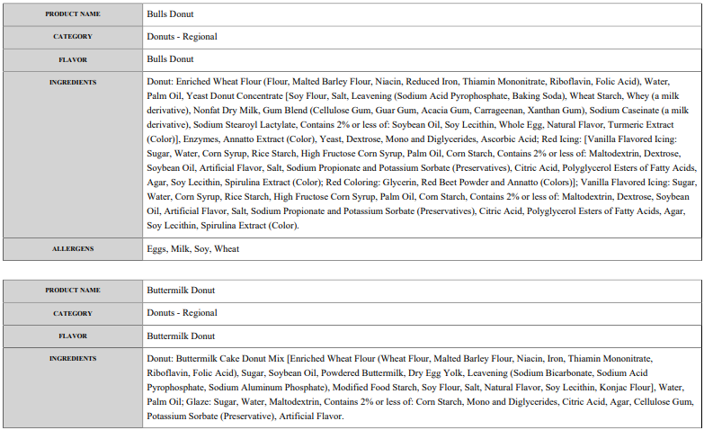

# Individual Project

## NomNom Safe

> - Anna Dinius

---

## NomNom Safe as a Solution

### Problem:

- **Difficulty accessing reliable allergen and dietary information from independent and locally-owned food service businesses**, who often lack accessible tools for sharing that information

---

## Example: Smokey Bones (4 pages)

---

## Example: Cheesecake Factory (13 pages)

---

## Example: Dunkin' Donuts (182 pages)

---

# Sprint 1 Retrospective

## (9/8/2025 - 10/14/2025)

---

## Project Metrics

- Number of features planned: **4**
- Number of features implemented: **4**
- Number of requirements planned: **4**
- Number of requirements met: **4**
- 🔥 Burndown rate:
  - **100%** total
  - **25%** per week
  - **~3.6%** per day
- Total LoC: **1,403**

---

## Features Implemented

✅ Allergen input/selection
✅ Ability to change allergen input/selection
✅ List of restaurant names based on allergen input/selection
✅ Ability to view restaurant information (cuisine, address, hours, website, phone number)

---

## What Went Wrong

- Milestones/plan was not fully fleshed out
- Schedule complications

## What Went Well

- 100% burndown rate overall

## Analysis & Improvement Plan

- Apply the start early, finish early rule

---

## Week-by-Week Progress Summary

- Week 2: Design, DB set up, home page UI, restaurant list retrieval
- Week 3: Filter restaurants by allergen selection, restaurant detail page UI
- Week 4: UI improvements
- Week 5: generate tests, implement error handling, refactored code

---

# Sprint 2 Plan

## (10/20/2025 - 11/23/2025)

---

## Goals

Implement the following features:

1. Filter restaurants by cuisine
2. View restaurant menu
3. Filter menu items
4. User profiles

---

## Metrics

Total number of features planned: **4**
Total number of epic requirements planned: **5**
Total number of sub requirements planned: **15**
Total number of requirements planned: **20**

---

## Timeline & Milestones

- Week 6: Implement restaurant filter feature
- Week 7: Implement view restaurant menu feature
- Week 8: Implement filter menu items feature
- Week 9: Implement user profiles feature
- Week 10: UI improvements, testing, bug fixing, documentation

---

## Key Dates

- Individual presentation: 10/29/2025
- Individual milestones:
  1. 10/26: have restaurant filter feature fully implemented
  2. 11/2: have view restaurant menu feature fully implemented
  3. 11/9: have filter menu items feature fully implemented
  4. 11/16: have user profiles feature fully implemented
  5. 11/23: have testing, documentation, and error handling completed
